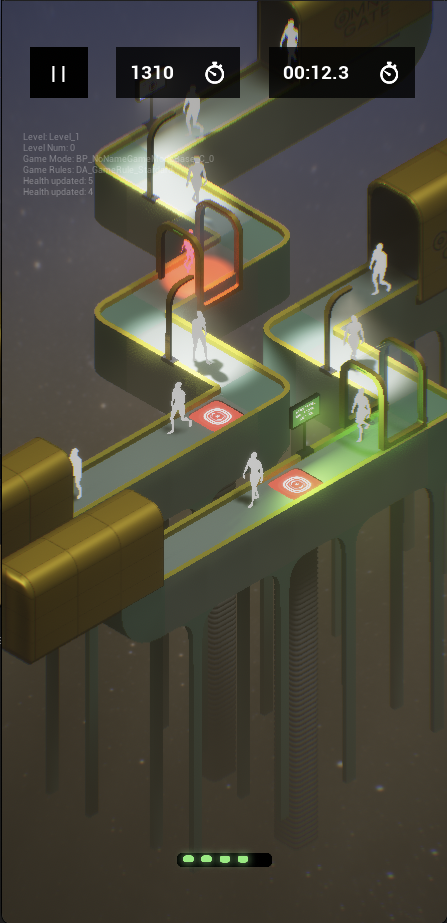
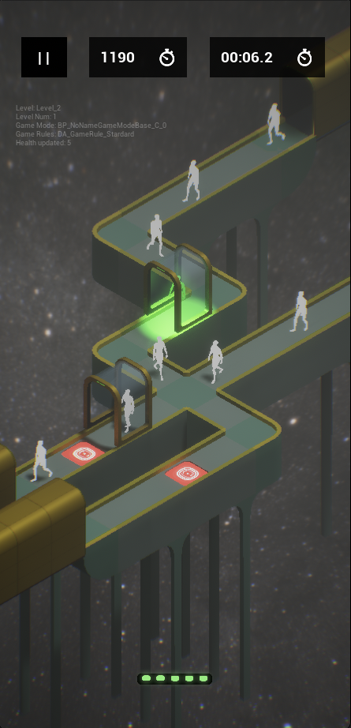

# STOP - Unreal Engine 5 Mobile Game

STOP is a mobile game built with Unreal Engine 5. The player takes the role of a security operator tasked with scanning incoming passengers, identifying threats, and triggering trapdoors to stop dangerous individuals before they board.

The project focuses on clean gameplay system design, AI-driven behavior, and mobile performance optimization.


## Technologies Used
- Unreal Engine 5.5
- C++ for core gameplay mechanics and AI behavior
- Blueprints for UI and minor gameplay elements
- Mobile optimization techniques for iOS and Android
- Version control with Git and Perforce
- 3D modeling and texturing tools

## Getting Started
1. Clone the repository:
   ```bash
   git clone https://github.com/ArminTajik/stop-game.git
   ```
2. Open the project (the .uproject file) in Unreal Engine 5.5.


### Team
- Armin Tajik - C++ Game Programmer, Technical Artist
- Javier Fernandez Cordoba - Game Designer, 3D Artist, UI/UX Designer
- Farnoud Fathi - Game Designer, Producer & Project Manager


## Screenshots (Work in Progress)




---
## **Design**


### **Concept**
*STOP* is a fast-paced sci-fi border control game where players scan and trap dangerous alien passengers to protect the United Planets of America, balancing quick decision-making with the moral ambiguity of profiling intergalactic travelers.

### **Game Overview**
In *STOP (Space Travel Operational Protocol)*, players act as border control agents for the United Planets of America (UPA), tasked with identifying and stopping dangerous passengers from entering. Passengers, who vary in alien shapes and sizes, pass through a scanner revealing their internal features. Players must activate a trapdoor at the precise moment to eliminate dangerous passengers while allowing safe ones to pass. The game demands quick reflexes, spatial awareness, and attention to detail as the line moves rapidly and challenges escalate.

### Features
- Fast-paced, addictive gameplay loop
- Sci-fi aesthetic with retro-futuristic design
- Multiple game modes: Endless, Progressive, Story, and Speedrun
- Power-ups to assist players in challenging situations
- Leaderboards and achievements for competitive play
- Intuitive touch controls optimized for mobile devices


### **Target Audience**:
- **Primary**: 25–55-year-olds with mid-level gaming experience, seeking fast-paced hyper-casual games on iOS and Android.
- **Preferences**: Players who enjoy sci-fi themes, quick decision-making, and addictive, dopamine-driven gameplay (e.g., casino slot machine-like feedback).

### **Platforms**: Mobile (iOS and Android).


### **Core Gameplay Loop**

1. **Observe**: Watch passengers move through the line and scanner to identify dangerous traits.
2. **Identify**: Determine if a passenger is dangerous based on their internal features (e.g., dangerous elements like weapons or banned items - Color Coded Visually).
3. **Act**: Activate the trapdoor at the right moment to eliminate dangerous passengers while sparing safe ones.

### **Key Mechanics**

- **Scanning**: Passengers have an exterior (skin, hair, clothes) and interior (bones, organs, hidden objects) appearance. The scanner reveals their interior, showing dangerous elements if present by different color.
- **Line**: Passengers move along a predefined path (single or multiple tracks) from start to exit, passing through the scanner and trapdoor.
- **Trapdoor**: A platform that players can remove by tapping to make dangerous passengers fall, preventing their entry.

### **Player Actions**

- **Activate Trapdoor**: Tap the bottom of the screen to remove the trapdoor, causing the passenger on it to fall.
- **Observe Passengers**: Monitor passengers’ exterior and interior (via scanner) to identify dangerous traits.
- **Use Power-Ups**: Activate random power-ups (e.g., x-ray all, pause spawner, slow spawner) by tapping a special power button (except in Speedrun Mode, where a speedup button replaces it).

### **Game Modes**

1. **Endless Mode**:
    - **Goal**: Survive as long as possible to achieve a high score.
    - **Difficulty Scaling**: Increases passenger speed and Danger % (percentage of dangerous passengers) over time.
    - **Features**: Leaderboards for global rankings and achievements (e.g., “Stop 100 Dangerous Passengers”).
    - **Play Session**: Aim for 10–15 minutes until failure.
2. **Progressive Mode**:
    - **Goal**: Unlock levels by playing a level for a specific amount of time without losing all your lives. Levels increase in complexity and difficulty per level.
    - **Progression**: 30 levels with varied track layouts, multiple scanners, and higher Danger %. Each level introduces unique goals (e.g., stop specific passenger types) and achievements (e.g., “Complete Level 10 Without Mistakes”).
    - **Play Session**: 5–10 minutes per level.
3. **Story Mode**:
    - **Narrative**: TBD (e.g., a border agent uncovering a conspiracy in the UPA).
    - **Structure**: Progression through levels with narrative elements (TBD: cutscenes, dialogue, or unique objectives).
    - **Play Session**: 20–30 minutes for the full mode.
4. **Speedrun Mode**:
    - **Goal**: Complete a single, highly scripted, difficult level in the shortest time possible.
    - **Structure**: A fixed 7-minute level (at default playrate) with a predetermined sequence of passengers, track layout, and Danger % (e.g., 50% for maximum challenge). The level includes multiple tracks and scanners with complex passenger patterns.
    - **Speedup Mechanic**: Replaces the special power button with a **Speedup Button**:
        - **Function**: Increases the game’s playrate (e.g., 1.5x speed, subject to playtesting) when tapped, affecting passenger movement and scanner timing.
        - **Usage**: One-time use per attempt, lasts 10 seconds (subject to playtesting).
    - **Features**: Leaderboards for fastest completion times and achievements (e.g., “Complete Speedrun Mode in Under 5 Minutes”).
    - **Play Session**: Approximately 7 minutes at default playrate, with skilled players aiming for 4–6 minutes using the speedup button.

### **Win/Loss Conditions**

- **Win**:
    - **Endless/Progressive/Story Modes**: Correctly identify and trap 80% of dangerous passengers in a level (by number).
    - **Speedrun Mode**: Complete the scripted level by trapping all dangerous passengers with no mistakes.
- **Loss**:
    - **Endless/Progressive/Story Modes**: Exceed a fixed number of mistakes (TBD after playtesting, e.g., 5 missed dangerous passengers or 5 trapped safe passengers).
    - **Speedrun Mode**: Any mistake (missing a dangerous passenger or trapping a safe one) results in immediate failure.
- **Modifiers**:
    - **Endless Mode**: Score-based (higher scores extend playtime).
    - **Progressive/Story Mode**: Time-based (complete within a time limit) or score-based (minimum score for level completion).
    - **Speedrun Mode**: Time-based (fastest completion time determines ranking).

### **Camera**

- **Type**: Fixed isometric top-down camera.
- **Purpose**: Enhances spatial awareness by showing the entire line, scanners, and trapdoor, requiring players to track passenger positions across tracks.
- **Design Note**: Levels are designed with clear, visually distinct layouts to compensate for the fixed camera, with a zoomed-out perspective for multi-track visibility. Speedrun Mode uses an especially intricate layout to maximize difficulty.

### **Features**

#### **Basic Features**

- **Core Mechanics**: Scanning, trapdoor activation, and line movement.
- **UI**: Basic interface with scoring system, level selection, and power-up activation (or speedup button in Speedrun Mode).
- **Power-Ups** (randomly awarded, one-time use per activation, triggered via a special power button; not available in Speedrun Mode):
    - **X-Ray All**: Reveals the interior of all passengers on screen for 10 seconds (subject to playtest tuning).
    - **Pause Spawner**: Stops passenger spawning from one spawner for 10 seconds (subject to playtest tuning).
    - **Slow Spawner**: Reduces spawn rate of one spawner by 50% for 10 seconds (subject to playtest tuning).

#### **[TBD] Exotic Features**

- **Rare Power-Ups**: Additional power-ups beyond the basic set (TBD, e.g., temporary scanner range increase; not available in Speedrun Mode).
- **Unique Passenger Types**: Special passengers with distinct visuals or behaviors (TBD, e.g., passengers with multiple dangerous elements; included in Speedrun Mode for added difficulty).
- **Environmental Hazards**: Scanner malfunctions (TBD, e.g., flickering visibility or false positives; potentially included in Speedrun Mode for challenge).
- **Frequency**: Randomly triggered, with probability increasing by level (e.g., 5% chance in early levels, 20% in later levels; Speedrun Mode uses fixed hazards if implemented).

### **Level/Encounter Philosophy**

- **Philosophy**: Gradually increase complexity through:
    - New passenger types (e.g., varied dangerous elements or visual disguises).
    - Changing line layouts (single tracks in early levels, bridge/maze-like multi-track layouts in later levels).
    - Multiple scanners (e.g., dual filters like “red and square” dangerous elements).
- **Level Count**: 30 levels in Progressive Mode, each with unique track layouts, scanner counts (1–3), and Danger % (10–50%, increasing per level with randomization within a range). Speedrun Mode features one highly scripted level with a fixed layout and 50% Danger %.
- **Encounters**: No boss-like encounters planned (TBD if special events are added; Speedrun Mode may include unique passenger sequences as pseudo-encounters).

### **Passenger**

Passengers move from the line’s start to the exit, passing through the scanner and trapdoor. They have two appearances: exterior (visible normally) and interior (visible in the scanner).

#### **Properties**

- **Exterior**: 3D model with varied skin, hair, and clothing (retro-futuristic sci-fi aesthetic).
- **Interior**: 3D model showing bones, organs, and hidden objects (e.g., weapons, banned items).
- **Dangerous**: Boolean variable (true/false) based on the presence of dangerous elements. Determined by **Danger %** (10–50%, increasing per level, randomized within a range; 50% in Speedrun Mode).
- **Behavior**: Follow a fixed path with no aggression (TBD: minor speed variations or animations based on type; rare behaviors like faster scanner traversal for challenge, potentially in Speedrun Mode).

### **Line**

The line is a visible 3D path guiding passengers from start to exit, with varied shapes (e.g., straight, winding, bridge/maze-like) across levels. Speedrun Mode uses a fixed, complex maze-like layout.

#### **Properties**

- **3D Model**: Clear, stylized path (retro-futuristic design) showing the route.
- **Path**: Predefined waypoints for passengers to follow, ensuring consistent movement.

### **Scanner**

A cube-shaped area on the line where passengers’ interiors are revealed.

#### **Properties**

- **3D Model**: High-tech enclosure with windows (retro-futuristic design). Window size/orientation impacts difficulty (TBD after playtesting).
- **X-Ray Area**: 2x1.5x1.5m space where passengers’ exteriors become transparent, revealing interiors.
- **Location**: Positioned between the line’s start and trapdoor (multiple scanners in Speedrun Mode for added complexity).

### **Trapdoor**

A platform that players remove to stop dangerous passengers.

#### **Properties**

- **Size**: As wide as the line, twice the length of a passenger’s bounding box (ensuring full coverage).
- **Timing**: Activates instantly on tap, remains open just long enough for a passenger to fall (TBD: ~0.5 seconds, subject to playtesting).

### **UI and HUD**

- **HUD Elements**:
    - **Score**: Displays current score (points per passenger: +10 for trapping dangerous, -5 for trapping safe, TBD after playtesting; Speedrun Mode tracks time instead).
    - **Danger % Indicator**: Shows the current level’s danger probability (e.g., “Danger: 20%”; fixed at 50% in Speedrun Mode).
    - **Timer**: Tracks level time (Progressive/Story Mode), survival time (Endless Mode), or completion time (Speedrun Mode).
    - **Trapdoor Button**: Large, tactile button at the screen’s bottom for activation.
    - **Power-Up/Speedup Button**: Displays available power-up (Endless/Progressive/Story Modes) or speedup button (Speedrun Mode) with a juicy, animated effect.
    - **Feedback**: Casino slot machine-like “juicy” animations and sounds for dopamine-driven engagement (e.g., flashing colors, satisfying clicks).
- **Danger Indication**: Dangerous elements in the scanner are highlighted with color-coded outlines (e.g., red for weapons, yellow for banned items).
- **Screens**:
    - Main Menu: Start game, mode selection (including Speedrun Mode), settings, and about page.
    - Level Select: Choose levels (Progressive Mode) or start Endless/Story/Speedrun Mode.
    - Results Screen: Shows score, accuracy, and achievements (Progressive/Endless/Story) or completion time and ranking (Speedrun Mode).
    - Pause Menu: Options to resume, restart, or exit.
    - About: Game credits and version info.
- **Multi-Track Adaptation**: Zoomed-out camera with clear level layouts to emphasize multiple tracks and scanners, especially critical in Speedrun Mode’s complex layout.

### **AI Behaviors**

- **Standard Behavior**: Passengers follow the line’s fixed path with no aggression or deviation.
- **TBD**:
    - Minor variations (e.g., slight speed differences or animations per passenger type; potentially in Speedrun Mode for added challenge).
    - Rare behaviors (e.g., some passengers move faster through the scanner to hide dangerous elements; likely in Speedrun Mode).
- **Danger %**: Increases per level (10% in early levels, up to 50% in later levels) with randomization within a range (e.g., ±5%; fixed at 50% in Speedrun Mode).

### **Visual and Audio Aesthetics**

- **Visuals**: Retro-futuristic (inspired by Teenage Engineering tools), with sleek, neon-lit 3D models for passengers, scanners, and lines.
- **Audio**: Sci-fi sound effects (e.g., scanner hums, trapdoor clanks) and synth-based music for a futuristic, immersive vibe. Speedup button in Speedrun Mode triggers a distinct audio cue (e.g., accelerated tempo).
- **Feedback**: “Juicy” audio-visual effects (e.g., bright flashes, satisfying chimes) for actions like trapping passengers or activating power-ups/speedup.

### **Competitive Analysis**

- **Similar Games**:
    - Hyper-casual mobile games (e.g., fast-paced, addictive gameplay loops).
    - *Papers, Please*: Decision-making and moral ambiguity in border control.
- **Differentiation**: TBD (e.g., unique sci-fi aesthetic, fast-paced trapdoor mechanic, multi-track challenges, Speedrun Mode’s time-based challenge).
- **Focus**: Not for broadcast; emphasis on mobile hyper-casual engagement.

### **Additional Details**

- **Play Session Length**:
    - Endless Mode: 10–15 minutes (until failure).
    - Progressive Mode: 5–10 minutes per level.
    - Story Mode: 20–30 minutes for the full mode.
    - Speedrun Mode: ~7 minutes at default playrate, with skilled players aiming for 4–6 minutes.
- **Social Features**: Leaderboards for Endless Mode scores, Progressive Mode achievements, and Speedrun Mode completion times (no multiplayer or co-op).
- **Balancing**: Prioritizes hyper-casual accessibility over deep complexity, with simple mechanics and addictive feedback for broad appeal.

### **Development Notes**

- **TBD Elements** (require further discussion/playtesting):
    - Story Mode narrative and unique mechanics.
    - Specific mistake thresholds for loss conditions (all modes).
    - Exotic features (e.g., scanner malfunctions, additional power-ups; potential inclusion in Speedrun Mode).
    - Passenger behavior variations (speed, animations, rare actions; especially for Speedrun Mode).
    - Competitive differentiation strategies.
- **Playtesting Focus**:
    - Tune power-up durations (currently 10 seconds for x-ray/pause, 50% slow for 10 seconds).
    - Tune Speedrun Mode speedup button (1.5x playrate, 10-second duration).
    - Adjust trapdoor timing (~0.5 seconds open).
    - Balance Danger % randomization (all modes) and fixed 50% in Speedrun Mode.
    - Ensure “juicy” UI feedback, including speedup button, drives engagement without overwhelming players.
    - Test Speedrun Mode’s scripted level for difficulty and 7-minute default duration.